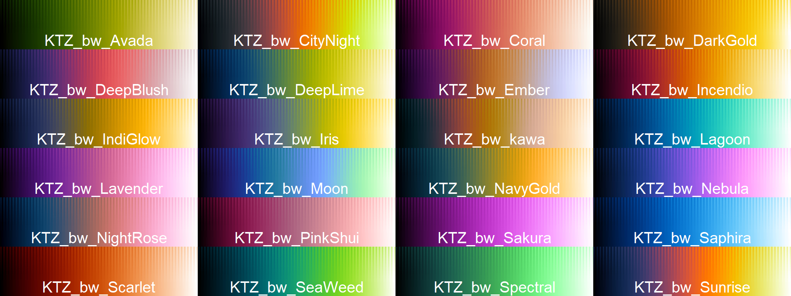
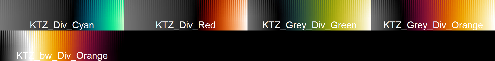
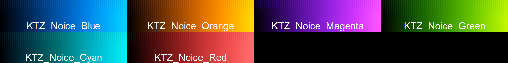
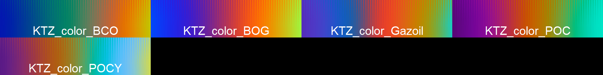

# KTZ-LUTs

## Handmade ImageJ / Fiji LUTs for microscopy, scientific good visualization and art.

* __Installation :__
	- in Fiji, add the KTZ-LUTs [Update Site](https://imagej.net/update-sites/following)
 	- Alternatively you can also get the LUTs with many other via the __NeuroCyto LUTs__ update site
	- For ImageJ, download this repository as .zip (green button top rigth), place .lut files in the lut directory of your ImageJ or Fiji application. (ImageJ/luts/)

## Colorful black to white LUTS ("bw") :     
Cool for single channel images. Each as its own "vibe"     
 

## Divergent and asymmetrical LUTS ("div") :   
For high dinamic range images   

## Misc LUTs :        
A "real fire" looking LUT, and a grey to black LUT, very feng shui.   

## Multichannel LUTs :

__4 channels : k__     
blue + orange = white and magenta + green too.     

__4+ channels : noice__      
A bit less scientific but more vibrant and cool     

__3 channels : poc__     
Looks better and saturates less than pure Cyan Magenta Yellow     

__3 channels : Klein LUTs__        
Inspired by Yves Klein triptic colors    

__3 channels : rgb__     
Alternatives to pure red green blue. The sum is white.    

__2 channels : inverted Owl and inverted Noice Orange/Blue__      
Owl are inspired by artist FalseKnees, ["Kneesvember" 2023](https://x.com/kWolbachia/status/1730642021147168954?s=20)  

__2 channels : Brick and Teal__     
Cool looking pair   

## Color coding LUTS :

__Not__ made for image visualization but for temporal / depth color coded projections.   

